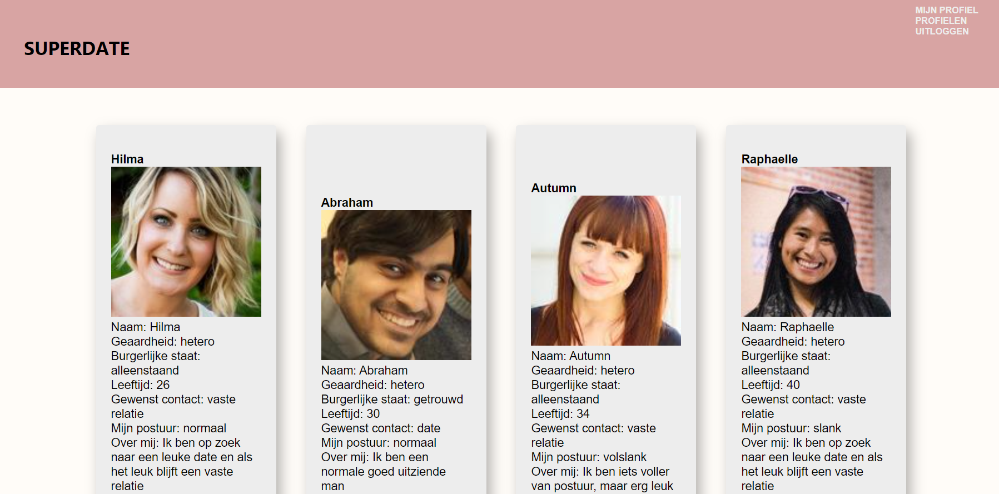

SUPERDATE DE APPLICATIE 
Groningen, december 2022

Inhoudsopgave:
1. Inleiding
2. Technische benodigdheden
3. Installatie instructies
4. Inloggen en accounts

1. Inleiding:
Welkom bij Superdate. Dit is een datingsite waarbij je zelf een profiel aan kunt maken en profielen van andere gebruikers kunt 
bekijken. Ook is het mogelijk om andere gebruikers berichten te sturen. 

3. Technische benodigdheden:
Om de applicatie op te starten dien je eerst een npm install uit te voeren, waarna een npm start. Dit doe je in de terminal. Open deze link: http://localhost:3000 om de
applicatie werkend te zien.

4. Installatie instructies:
De applicatie maakt gebruik van de Novi backend welke middels een link bereikt wordt. Hier hoef je verder niets voor 
te doen, de backend server is continue online. Mocht je meer informatie willen over de backend bezoek dan deze link:
https://github.com/hogeschoolnovi/novi-educational-backend-documentation/blob/main/README.md#0-test 

5. Inloggen en accounts:
Om in te loggen is het handig om zelf een account aan te maken via de home-pagina. Dit aangezien de Novi-backend de gegevens vaak al binnen een 
uur ververst waardoor ik geen inlog gegevens kan verstrekken. Vul op de registratie pagina je e-mailadres in, en bedenk zelf een gebruikersnaam
en wachtwoord. Let op: het wachtwoord moet minimaal uit 6 tekens bestaan. 

Veel succes met de applicatie!

