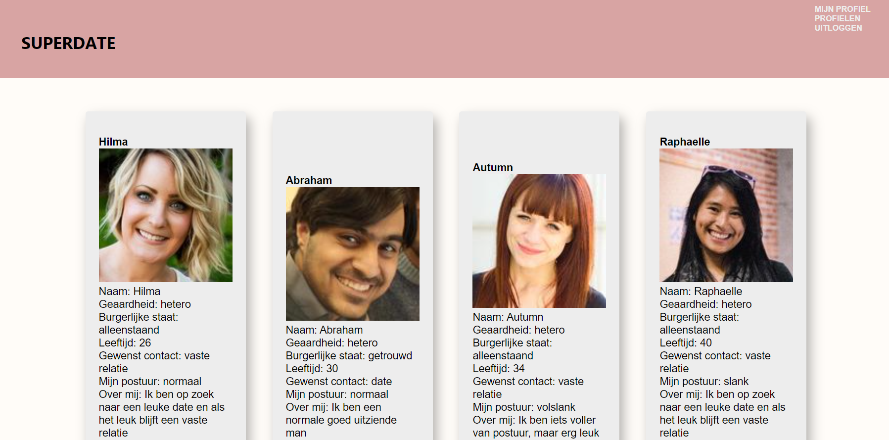

### *SUPERDATE DE APPLICATIE* 
*Groningen, 9 februari 2025*

## Inhoudsopgave:
1. Inleiding
2. Technische benodigdheden
3. Installatie instructies
4. Inloggen en accounts
5. Overige npm commando's 

## 1. Inleiding:
Welkom bij Superdate. SuperDate is een datingsite waarbij je zelf een profiel aan kunt maken en profielen van andere gebruikers kunt 
bekijken. Naast het bekijken van profielen zit er ook een filterfunctie op waarmee gericht gezocht kan worden op geslacht en leeftijd. Het eigen profiel 
kan ingevuld en gewijzigd worden en er kan een foto worden geupload welke naar eigen wensen in te stellen is qua formaat. Verder is er een recepten pagina, 
waarop door geklikt kan worden en tot een derde laag, echter kan er ook gezocht worden middels het invullen van 1 tot 3 ingredienten die je graag wilt gebruiken 
in het recept. 

*Screenshot van de dating profielen pagina:*

## 2. Technische benodigdheden:
Gezien de eerste opzet van deze applicatie uit het jaar 2022 stamt, is deze nog niet opgezet in een vite project, zoals dat anno 2025 wel gebruikelijk is.
De api's doen hun werk en je hebt hier verder geen api keys voor nodig om de applicatie te runnen. Ik maak gebruik van de [api_link] (https://fakerapi.it) en
de [api_link] (https://www.themealdb.com/). De node.js versie die op mijn computer is geinstalleerd is v16.16.0.
De bijbehorende css staat zoveel mogelijk in de pagina map, maar daar waar meerdere pagina's gebruik maakten van dezelfde css, 
heb ik het in de app.css geplaatst met in app.css met tekst erboven verwijzingen naar waar de css voor dient. De css die behoort tot de pagina in dezelfde map heb ik
zoveel mogelijk logische namen gegeven, zodat direct duidelijk is waar de css voor dient. De data in de dating profielen is dummy data opgehaald middels een api en natuurlijk 
staan op een echte datingsite geen telefoonnummers, email- en webadressen, ik heb hier echter wel gebruik van gemaakt in de weergave op de pagina, omdat de data die middels
de dating api op te halen is vrij summier is. De Css reset is te vinden in de index.css. De applicatie maakt voor het inloggen en registeren gebruik van de Novi backend welke
middels een link in de applicatie zelf bereikt wordt. Hier hoef je verder niets voor te doen, de backend server is continue online. 
Mocht je meer informatie willen over de backend bezoek dan deze link: [backend] (https://github.com/hogeschoolnovi/novi-educational-backend-documentation/blob/main/README.md#0-test)

## 3. Installatie instructies

*Het opstarten van de applicatie:*

1. Controleer eerst of node.js is geinstalleerd op je computer, dit kun je doen door cmd te typen in het zoekveld onderin (windows), de opdrachtprompt opent zich
   en vervolgens typ je node -v.  In het geval node.js helemaal nog niet geinstalleerd is installeer dan via [link_node.js] (https://nodejs.org/en/download/)
   Controleer nu nogmaals de versie met node -v. Een versie 16.16.0 is de versie die goed is om deze applicatie te draaien, dus als er een oudere of nieuwere versie verschijnt, 
   typ dan: nvm install 16.16.0. Mocht je daarna weer terug willen naar de oorspronkelijke versie herhaal dan de stappen met de versie die als eerste verscheen. 
2. Installeer een IDE zoals bijvoorbeeld Webstorm (via JetBrains) en start het programma op. 
3. Ga (rechtsbovenin) naar open en zoek daar de project map en klik op ok of ga naar get from VCS (rechtsbovenin) en plak vervolgens de 
   repository link: [repository_link] (https://github.com/MaryLCrea/Eindopdracht-superdate.git) en klik op clone.
4. Open links onderin de terminal.
5. Voer hierna een npm install uit door dit te typen in de terminal of wanneer webstorm hier (rechtsonderin) zelf mee komt door te klikken op npm install.
6. Vervolgens check je of de react-router-dom in package.json staat. Op hetzelfde niveau als de src map staat een bestand genaamd package.json. Zoek in dit bestand naar
  react-router-dom. Staat deze er in, ga dan naar de volgende stap. Staat deze er niet in, installeer deze dan door in de terminal het commando: "npm install react-router-dom"
7. Hierna voer je het commando "npm start" in.
8. Vervolgens opent de webpagina van de SuperDate applicatie zich automatisch in een nieuw scherm. Mocht dit niet het geval zijn, open dan deze link: [applicatie] (http://localhost:3000) 

## 4. Inloggen en accounts:
Om in te loggen is het handig om zelf een account aan te maken via de home-pagina. Dit aangezien de Novi-backend de gegevens vaak al binnen een 
uur ververst worden, waardoor ik geen inlog gegevens kan verstrekken. Vul op de registratie pagina je e-mailadres in, en bedenk zelf een gebruikersnaam
en wachtwoord. Let op: het wachtwoord moet minimaal uit 6 tekens bestaan. 

## 5. Overige npm commando's
Mocht je willen stoppen met het draaien van de applicatie dan kun je de toetscombinatie ctl+c intypen in de terminal en vervolgens y intypen en een enter geven, 
het runnen van de applicatie is nu gestopt. 

Verder nog een belangrijke note. De applicatie is in het engels geschreven, dit omdat de recepten die ik terug kreeg middels de 
api ook in het engels zijn. Wanneer je dus een zoekactie doet op de recepten pagina, typ dan ook Engelse termen in, anders komen er geen recepten terug. 

Veel plezier en succes met de applicatie!

